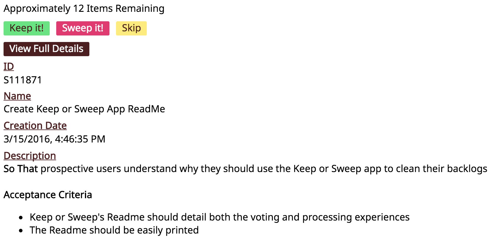
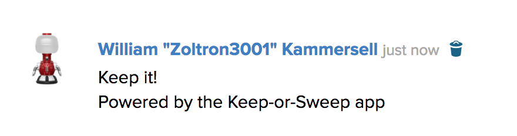
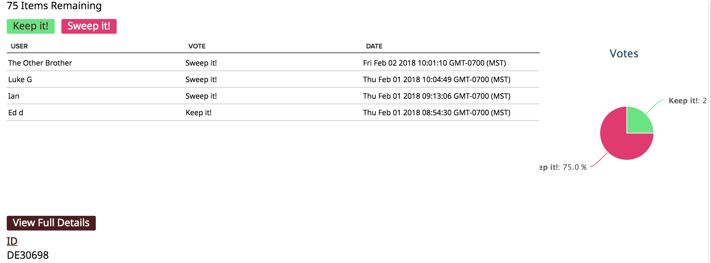

keep-or-sweep
=========================

## Overview

Is your backlog out of control? Do you add new stories to it, never to find them again amidst the hundreds of old crufty items? Or did you inherit a backlog and have no idea what's wheat and what's chaff? Now there's no need to despair, as this Keep or Sweep app will make wading through your backlog painless, collaborative, and even fun.

It's a good practice to keep your backlog under 100 items as the human brain has trouble keeping 100+ items in memory, and it's unlikely that you'll complete 100 items before they get out of date. So use this app whenever your backlog is getting large, or make it part of a quarterly event to keep your backlog fresh.

## Vote Experience

Rather than having one person, like the Product Owner, assess every item on the backlog, this app gets the whole team collaborating on what's good to keep or ready to sweep to the Recycle Bin. Harness the collective wisdom of your team to make the best decisions. First, create a shared custom page with this app and have each team member use it to review the baklog at their leisure over a couple days to a week. They'll be presented with each item on the backlog one at a time with brief details of the work item:

When they click the "Keep it!" or "Sweep it!" buttons, their vote will be recorded on the work item's discussion for later access:

In the app's settings you can specify options to limit which items are presented for votes and when votes expire.

## Processing Experience

Once your team has voted, it's time to process the votes. You can either do this solo, or as a team ceremony to quickly clean the backlog. In processing mode, each work item is presented again with a summary of the votes:

If everyone voted to sweep it, you can press "Sweep it!" to delete the item. If everyone voted to Keep it, you can press "Keep it!" to leave it and move on to the next item. If there's a mix of votes, have a conversation with your team to learn why there are differing opinions to come to a consensus. Repeat with each old work item to ultimately delete everything you can to simplify your backlog.

Hopefully your team finds this app useful! Any feedback and suggestions for enhancement are welcome. Happy backlog cleaning!